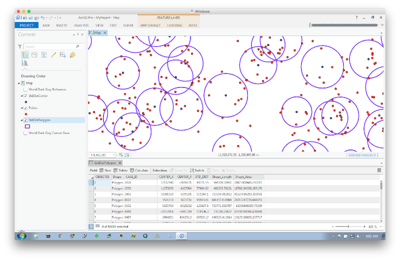
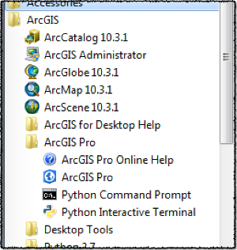

# Spark Standard Distance

Spark job to compute the [standard distance](http://pro.arcgis.com/en/pro-app/tool-reference/spatial-statistics/h-how-standard-distance-spatial-statistic-works.htm) for a set of points grouped together by a case field. 



## Testing the Result

The testing classes cross-reference the calculation in this project with the results of the [Standard Distance Tool](http://pro.arcgis.com/en/pro-app/tool-reference/spatial-statistics/standard-distance.htm) in ArcGIS Pro.

- A file containing random points was generated in the form of `CASE_ID,LON,LAT` using the script `points-file.sh`.
- `Make XY Event Layer` tool imports the generated point file.
- `Project` tool projects the import points to a `Web Mercator` coordinate system.
- `Add XY Coordinates` tool augments the feature attributes with the mercator XY coordinate values.
- `Standard Distance` tool calculates the standard distance of the points grouped by the `CASE_ID` field.
- `Table to Table` tool exports to CSV the mercator point feature class and the standard distance polygon feature class.
- The test class `StdDistSpec` reads the CSV point feature class and calculates the standard distance and mean coordinates and compares the results to the output of the CSV polygon values.

*Note*: I used the CSV format rather than for example Shapefile as it is easier while debugging to read the content from CLI.

## Building the Project

```bash
mvn clean package
```

## Running The Project

Download and install the [Docker Toolbox](https://www.docker.com/products/docker-toolbox) and create a docker machine in [VirtualBox](https://www.virtualbox.org/wiki/Downloads):

```bash
docker-machine create\
 --driver virtualbox\
 --virtualbox-memory 4096\
 --virtualbox-cpu-count 4\
 --virtualbox-disk-size 40960\
 --virtualbox-no-vtx-check\
 quickstart
```

Get the IP of the machine:

```bash
docker-machine ip quickstart
```

Set the docker environment variables:

```bash
eval $(docker-machine env quickstart) 
```

As superuser on your host, update the `/etc/hosts` file to include the `quickstart` docker-machine:

```bash
copy /etc/hosts /etc/hosts-orig
echo -e "\n$(docker-machine ip quickstart) quickstart.cloudera cloudera.quickstart quickstart cloudera qs" >> /etc/hosts
```

On Windows as **administrator** update `C:\Windows\System32\drivers\etc\hosts` to include the docker machine ip and reference `quickstart.cloudera`.

Run a [Cloudera Docker Container](http://www.cloudera.com/documentation/enterprise/5-6-x/topics/quickstart_docker_container.html):

```bash
docker run\
 --rm\
 --privileged=true\
 --hostname=quickstart.cloudera\
 -v /Users:/Users\
 -p 2181:2181\
 -p 4040:4040\
 -p 7180:7180\
 -p 8020:8020\
 -p 8032:8032\
 -p 8033:8033\
 -p 8042:8042\
 -p 8080:8080\
 -p 8088:8088\
 -p 8888:8888\
 -p 9083:9083\
 -p 10000:10000\
 -p 21050:21050\
 -p 28080:28080\
 -p 50010:50010\
 -p 50020:50020\
 -p 50060:50060\
 -p 50070:50070\
 -p 50075:50075\
 -p 50111:50111\
 -t -i cloudera/quickstart\
 /bin/bash
```

*Note* the `-v` option to enable the mapping of this projects' files between the docker host and the container. This is very handy for iterative development and testing.

In the container, start Zookeeper, HDFS and WebHDFS:

```bash
DAEMONS="\
cloudera-quickstart-init \
zookeeper-server \
hadoop-hdfs-datanode \
hadoop-hdfs-namenode \
hadoop-hdfs-secondarynamenode \
hadoop-httpfs"

for daemon in ${DAEMONS}; do
    sudo service ${daemon} start
done
```

Navigate to this project's folder from `/Users` (assuming it is accessible from there) and generate data using the `points.awk` script and put it into HDFS:

```bash
awk -f points.awk | hadoop fs -put - points.csv
```

Run the Spark job with properties from `app.properties`:

```bash
spark-submit target/spark-std-dist-0.1.jar app.properties
```

## Viewing the Results

This project includes the file `StdDistToolbox.pyt`. The latter is an [ArcPy](http://pro.arcgis.com/en/pro-app/arcpy/get-started/what-is-arcpy-.htm) based tool that uses the [HDFS](http://hdfscli.readthedocs.io/en/latest/) python module to read files off HDFS and converts the content to features in an ephemeral feature class.

Install the `HDFS` python module by running the `ArcGIS Pro > Python Command Line` as **administrator**, and execute `pip install hdfs`.



The toolbox consists of the following tools:

- `ImportPointTool` - Reads and displays the point data from HDFS in the form `CASE_ID,LON,LAT`.
- `ImportStdPointTool` - Reads and displays the center of the standard distance polygons. 
- `ImportStdPolygonTool` - reads and displays the standard distance polygons in WKT format.

## TODO

- Implement weighted values
- Implement a `reduceByKey` rather than a `groupByKey`
- Implement a single pass for the computation of the sum of the difference between a point and the mean 
- Implement Directional Distribution (partially done :-)
- Make ArcPy draw the standard distance polygons and directional distribution ellipses
- Implement StdDist as Python aggregated UDF for SparkSQL
